<h1 align="center">Fujitsu CELSIUS J5012 Hackintosh (macOS 15/26)</h1>

<p align="center">
  <strong>A Perfect "Mac-like" Hackintosh Workstation based on Intel 13th Gen Core i5-13500 + Dual AMD GPUs</strong>
</p>

<p align="center">
  
  
  
  
  
  
</p>

<p align="center">
  <a href="README.md">🇨🇳 中文</a> | <a href="README_en.md">🇺🇸 English</a>
</p>

---

## 📖 Project Introduction

This project provides a complete OpenCore boot configuration for running macOS on the Fujitsu CELSIUS J5012 workstation (the underlying bootloader currently used is **OpenCore v1.0.x**).
Targeting this **5-bay, dual-GPU, multi-NIC** geek-level hardware beast, we have completely refactored and optimized the low-level drivers. It currently fully supports the latest **macOS 26 (Tahoe)** and **macOS 15 (Sequoia)**, while remaining backward compatible with macOS 13 (Ventura). The system runs extremely stably, not only achieving full-blooded dual-GPU rendering but also solving the SATA deadlock issue on 13th-gen motherboards running native macOS 15+.

## 💻 Hardware Specifications

| Component | Detailed Model Info | Status / Notes |
| :--- | :--- | :--- |
| **Processor (CPU)** | 13th Gen Intel Core i5-13500 (14 Cores 6P+8E) | ✅ XCPM Turbo Boost works perfectly, unsupported UHD 770 iGPU disabled |
| **Memory (RAM)** | 64 GB DDR4 3200 MHz | ✅ Recognized normally and running at full speed |
| **Main GPU (GPU 1)** | AMD Radeon RX 5700 XT (8GB) | ✅ External via Oculink, host-side link **Gen4 x4** (x16 downstream of the card's internal switch), Metal 3 supported, full hardware encoding/decoding |
| **Secondary GPU (GPU 2)** | AMD Radeon RX 550 (4GB) Sapphire | ✅ Internal Slot-1 on the CPU PEG1 port, **Gen3 x8**, Metal 2 supported, dual GPUs coexist without conflicts |
| **Wired Network** | Intel I219-V + Expansion Intel 82576 NS | ✅ Dual Gigabit/Multi-port native drivers |
| **Wireless/Bluetooth** | Broadcom BCM43xx (DW1820A / Similar Models) | ✅ AirDrop, Handoff, Universal Clipboard perfect (Requires OCLP) |
| **Storage (NVMe)** | Samsung 970 EVO Plus 1TB & 500GB | ✅ Full x4 speed, dual drives/OS, `NVMeFix.kext` recommended |
| **Storage/Optical (SATA)**| 512GB SSD + 860 EVO 250G + HL-DT-ST DVD Drive | ✅ **Native SATA ports fully working**, no PCI/USB deadlocks |
| **Audio** | Motherboard Audio + AMD HDMI Audio | ✅ `alcid=69`, perfect multi-channel output, independent audio for both GPUs |

> **💡 Dual-GPU Special Note:** In this machine's dual-GPU architecture, one graphics card is installed internally in the chassis, while the other is an external GPU (eGPU) connected via a motherboard PCIe-to-Oculink adapter. Both cards work together perfectly under macOS.

## 🌟 Compatibility & Core Optimizations

This EFI is not a simple "patchwork"; deep "de-Hackintoshing" tuning has been applied to underlying drivers and logic:

### Working Perfectly
- ✅ **Dual-GPU Collaborative Architecture**: The primary card (RX 5700 XT) handles heavy rendering, while the secondary card (RX 550) handles multi-monitor display, each with independent audio channel labels (`onboard-1` & `onboard-2`).
- ✅ **Perfect Hardware Decoding without iGPU**: SMBIOS bound to `MacPro7,1`, successfully forcing all video hardware decoding/encoding tasks (UVD/VCE) to the AMD dedicated GPUs, completely solving software crashes caused by unsupported iGPUs.
- ✅ **SATA Interface Revived (macOS 15/26)**: Unlocked the kernel version limitation of `CtlnaAHCIPort` and safely removed the block interception on `AppleAHCIPort`, perfectly mounting dual SATA SSDs and the optical drive.
- ✅ **Intel vPro Technology Perfect Compatibility**: Running the Hackintosh system does not conflict with the native Intel vPro hardware-level management technology. Features like remote management and KVM via vPro work perfectly.
- ✅ **Sleep & Power Management**: Underlying power strategies (`tcpkeepalive`, `powernap`, `womp`, `proximitywake`) have been disabled via terminal. Sleep is extremely stable, saying goodbye to random wake-ups or sleep death.
- ✅ **Cold Boot Anti-Freeze Optimization**: Changed APFS `SetApfsTrimTimeout` to `-1`, completely eradicating the deadlock freeze caused by slow NVMe initialization when loading `libignition` in macOS 15/26.
- ✅ **Apple Ecosystem**: iCloud, App Store, AirDrop, Sidecar, etc., all work normally.

### Not Working / Flaws
- ❌ **Long-term Sleep Death**: Limited by specific hardware architecture, short-term sleep can wake up, but long-term sleep will inevitably lead to sleep death (black screen on wake or direct reboot). It is recommended to **completely disable system sleep** in System Settings. This issue is highly likely unsolvable.
- ❌ Intel UHD Graphics 770 (Since Intel 11th Gen, macOS completely dropped support for iGPUs; a natively supported dGPU is mandatory).

## 📸 Screenshots

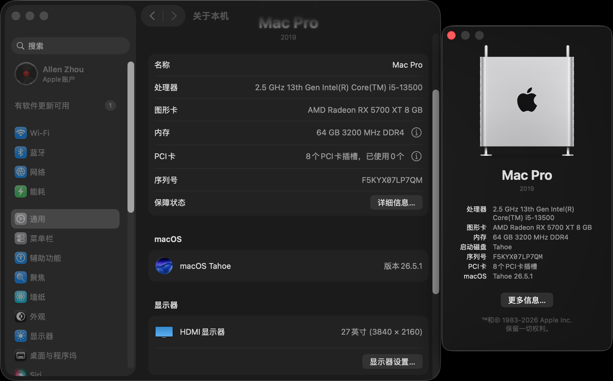
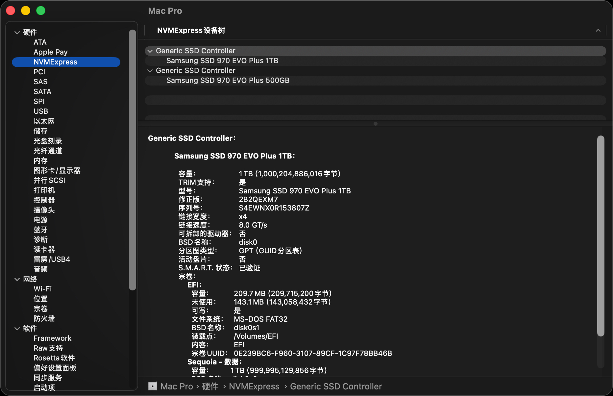
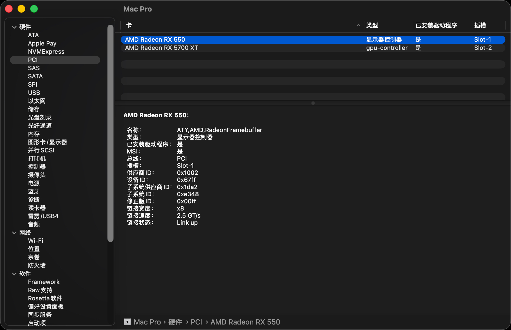
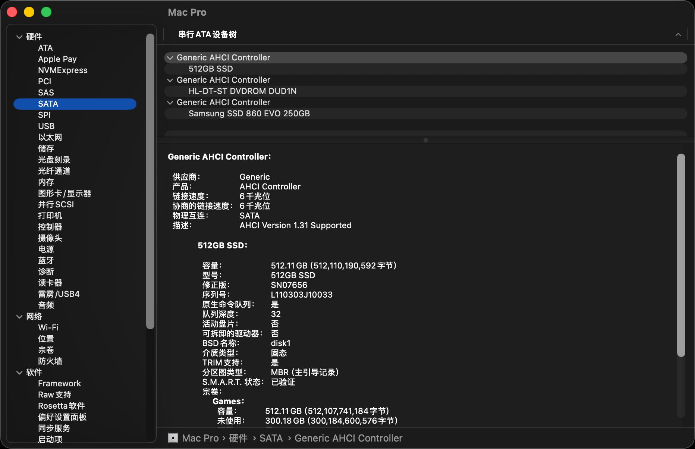
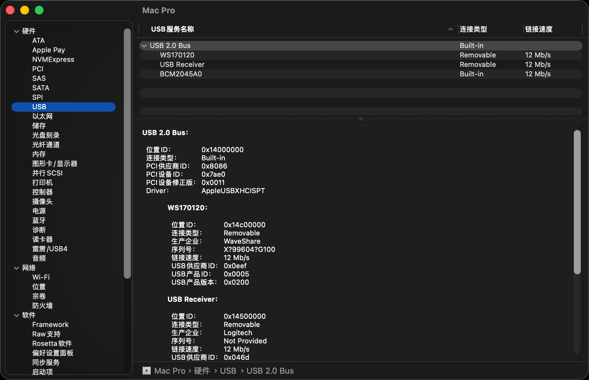
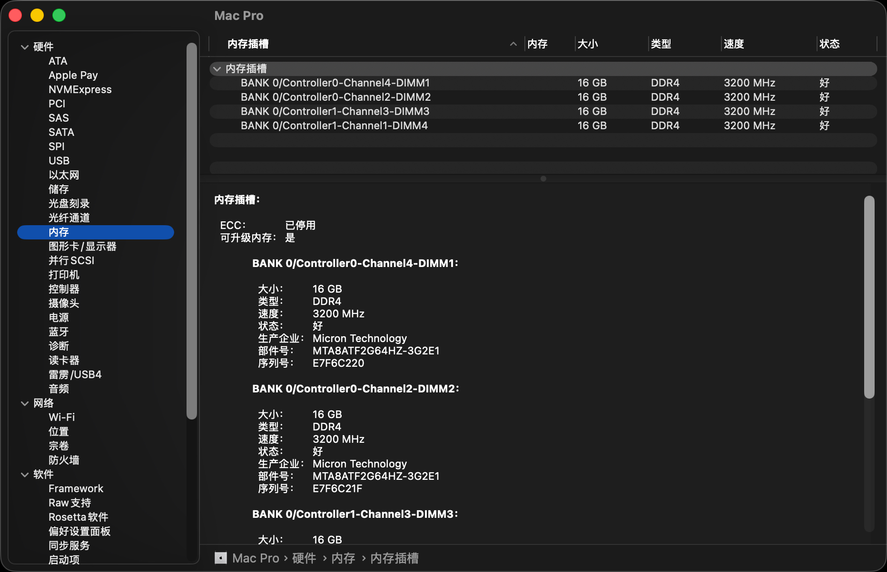
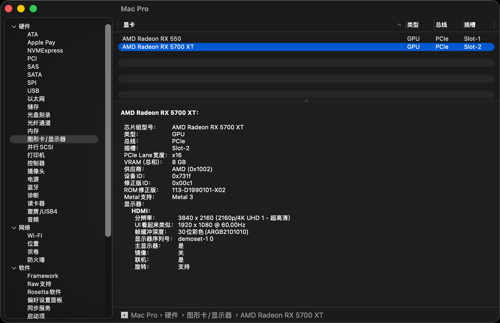
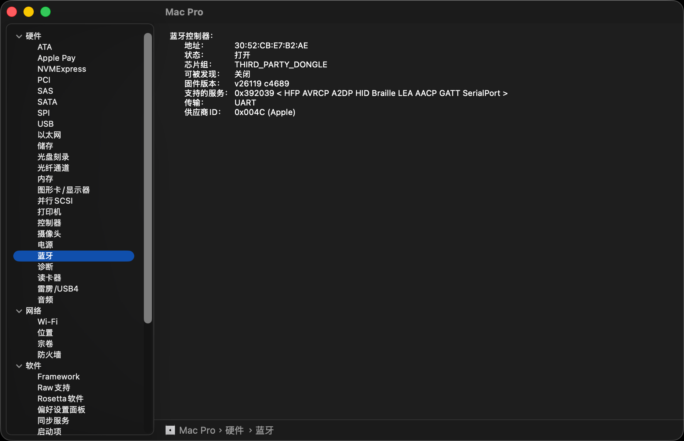
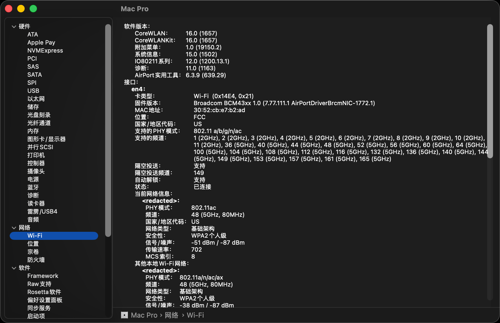
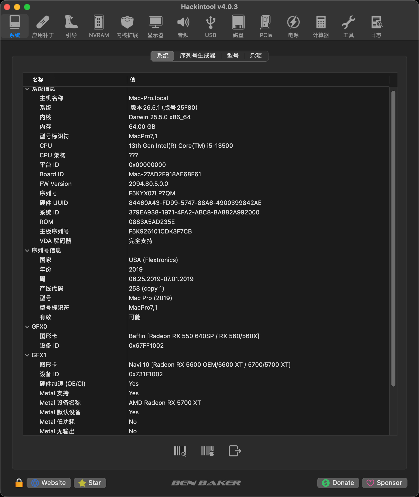
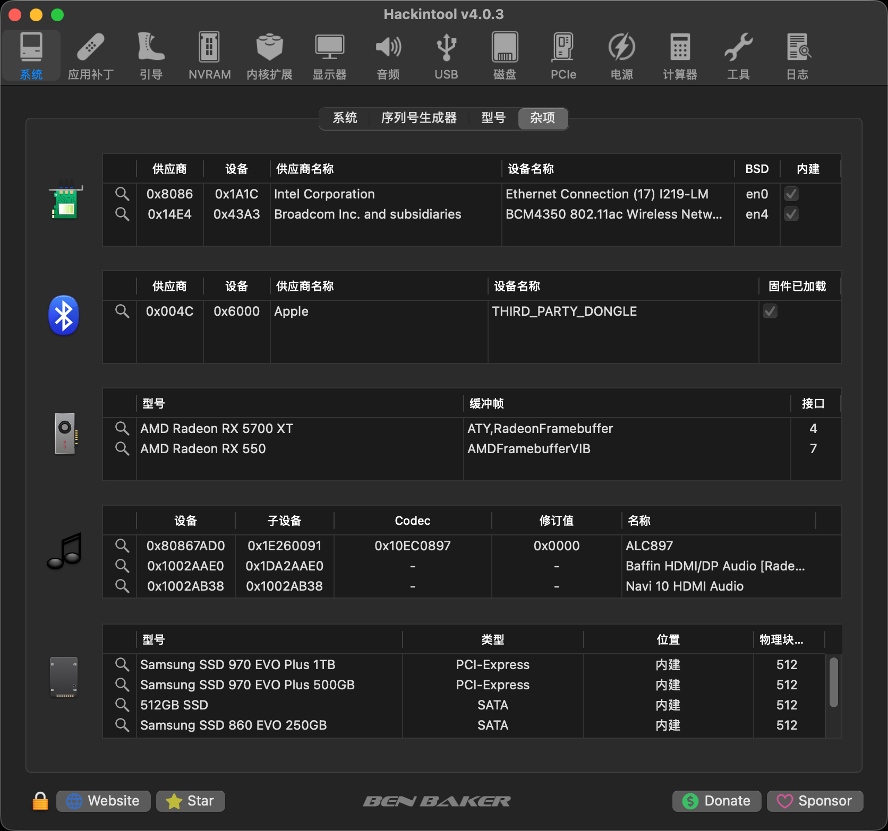

## ⚙️ Fujitsu BIOS Settings

> **💡 Note:** As a pre-built OEM machine, Fujitsu's BIOS offers very few user-modifiable options. The following are only **recommendations** for the limited options you can change. If you cannot find certain options in your BIOS, simply keep them at default.

Before booting with this EFI, please press **F2** at startup to enter the BIOS and configure the following:

**Must be Disabled:**
- Security -> **Secure Boot**
- Security -> **Intel SGX**
- Advanced -> System Agent (SA) Configuration -> **VT-d** (if DisableIoMapper is not enabled)
- Boot -> **Legacy Boot** (Must be pure UEFI)
- Fast Boot / CSM

**Must be Enabled:**
- Advanced -> CPU Configuration -> **Intel Virtualization Technology (VT-x)**
- Advanced -> Devices -> **USB Configuration (All ports)**
- Advanced -> Devices -> **XHCI Hand-off**
- OS type: Windows 8.1/10 UEFI Mode
- SATA Mode: **AHCI** (Extremely important)
- Above 4G decoding

## ⚠️ Troubleshooting & Notes

1. **OCLP Patches & Cold Boot:** 
   To drive the obsolete Broadcom network card on macOS 15/26, the system disables Apple's keystore (`-applekeystore=disabled`) and lowers the security level. Occasional code-scrolling freezes on cold boot are normal side effects of these patches. A **forced warm reboot** usually boots directly into the system.
2. **AirDrop Not Found:** 
   If devices cannot be found under "Contacts Only" mode, please switch to "Everyone" in the Control Center. Alternatively, execute the following commands in the terminal to reset the hash pool:
   ```bash
   defaults delete com.apple.sharingd AirDropRandomHashUUIDKey1
   defaults delete com.apple.sharingd AirDropRandomHashUUIDKey2
   defaults delete com.apple.sharingd "HashManager-LastDeviceIDHashKey"
   killall sharingd
   ```
3. **NVRAM Reset (Crucial):** 
   Every time the EFI is updated (especially when underlying SATA or core driver logic in config.plist is modified), **you must press the spacebar in the OC menu during the first boot, select `Reset NVRAM`, and hit enter**, otherwise the new driver strategies may not take effect or may even cause kernel panics.
4. **Samsung NVMe SSDs:**
   Two Samsung 970 EVO Plus drives are currently used. Due to compatibility issues between their original controllers and Apple's native drivers, it is recommended to add and enable `NVMeFix.kext` in later configurations to prevent Kernel Panics under high loads.

## 🔄 Changelog

### v2.0 (June 30, 2026)
- **SATA Fix**: Unlocked native SATA driver limitations, perfectly recognizing dual SATA SSDs and the optical drive in macOS 26 (Tahoe).
- **Cold Boot Optimization**: Forced APFS Trim timeout (`SetApfsTrimTimeout`) to `-1`, optimizing cold boot speed and stability.
- **Architecture Upgrade**: Confirmed stable operation of the RX 5700 XT + RX 550 dual-GPU hybrid rendering array.

### v1.x (June 28, 2026 and earlier)
- **System Adaptation**: Initial support and adaptation for macOS 26 (Tahoe) / macOS 15 (Sequoia).
- **Network Fix**: Combined `IOSkywalkFamily` and `AMFIPass` to revive the Broadcom network card.
- **Foundation**: Provided a compatibility solution based on OpenCore from Ventura 13.x up to the latest macOS.

## 👏 Credits

- [Acidanthera](https://github.com/acidanthera) team for the outstanding OpenCore bootloader and various core Kexts.
- Hackintosh communities (Dortania, etc.) for their detailed installation guides and troubleshooting ideas.

---

*Disclaimer: This project is for technical research and educational purposes only. Due to variations in hardware qualities, any data loss or hardware damage caused by directly applying this configuration is at your own risk. Please ensure your use of macOS complies with Apple's licensing agreements.*